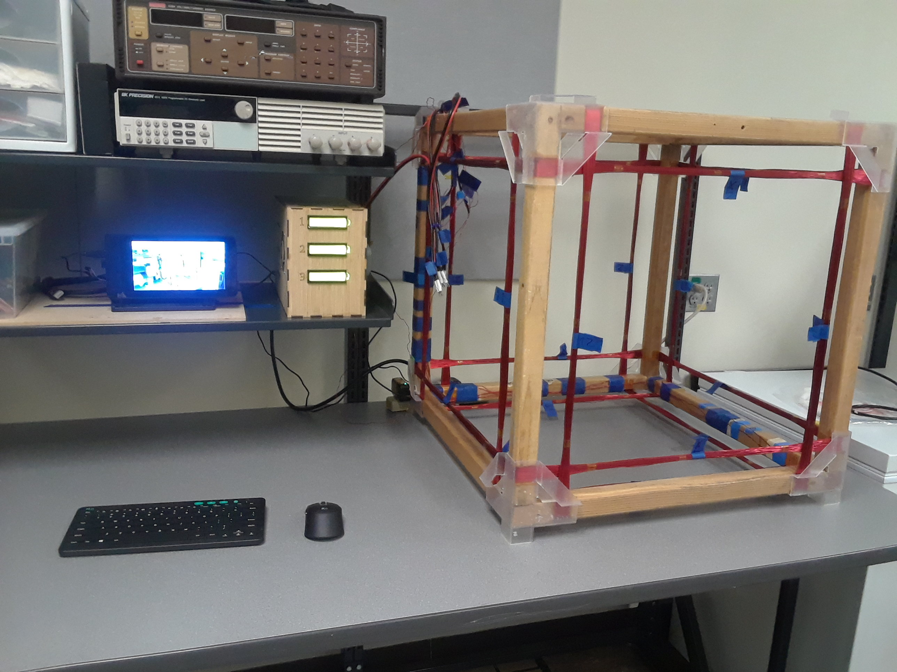

# Oregon Satelite Helmholtz Cage

## Magnetic Environment Simulator for CubeSats

The __Standard Operating Procedure__ can be found on the [Electronics Prototyping Lab website](http://psu-epl.github.io/doc/equip/testing/ETL)

##### A 2018 MCECS BETA Project

---

# Package, Build, and Deploy

**Build:**

`$ ` `python3 setup.py sdist bdist_wheel`

**Deploy:**

`$ ` `python3 -m twine upload dist/*`

# Local *(Raspberry Pi)* Installation

**Install:**

`$ ` `python3 -m pip install helmholtz-cage`
